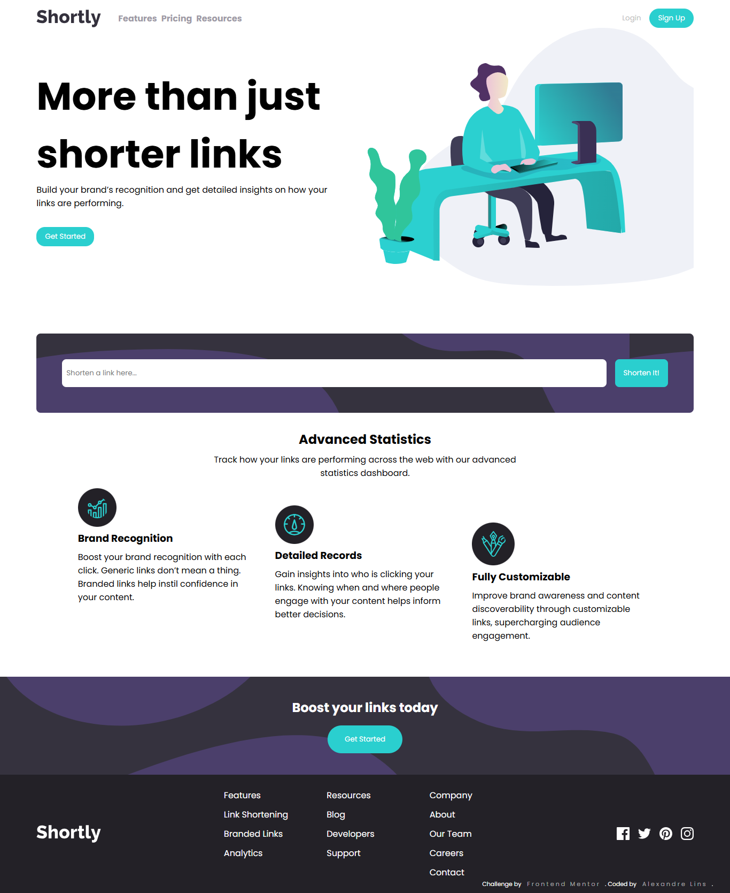

# Frontend Mentor -  Url Shortening Solution

This is a solution to the [ challenge on Frontend Mentor](https://www.frontendmentor.io/challenges/). 

Frontend Mentor challenges help improve my coding skills by building realistic projects. 

## Table of contents

- [Overview](#overview)
  - [Screenshot](#screenshot)
  - [Links](#links)
- [My process](#my-process)
  - [Built with](#built-with)
  - [What I learned](#what-i-learned)
  - [Continued development](#continued-development)
- [Author](#author)

## Overview

### Screenshot

### Links

- Solution URL: [Repository](https://github.com/aslinsjr/url-shortening)
- Live Site URL: [Page](https://url-shortening-vert.vercel.app/)

## My process

### Built with

- Semantic HTML5
- CSS custom properties
- Flexbox
- CSS Grid
- React

### What I learned

I learned how to overcome some challenges with positioning, margins and how to create small button animations using just HTML and CSS.

### Continued development

In the process of continuing to develop my skills, I intend to focus on deepening use of FlexBox and the precision of responsiveness.

## Author

- Linkedln - [Alexandre Lins](https://www.linkedin.com/in/aslinsjr/)
- Frontend Mentor - [@aslinsjr](https://www.frontendmentor.io/profile/aslinsjr)

